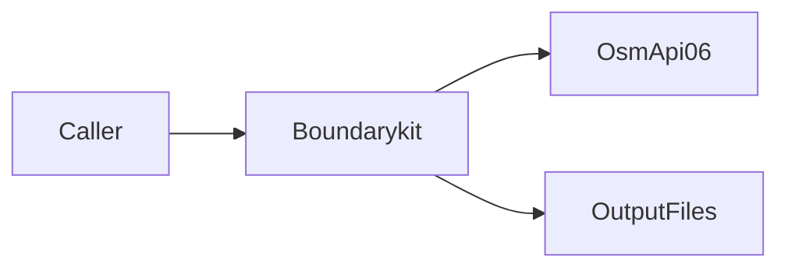
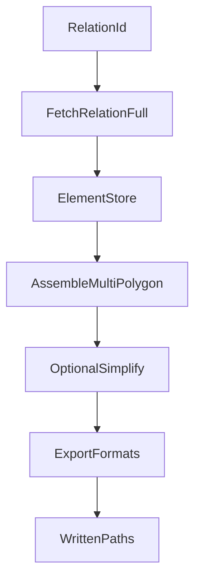
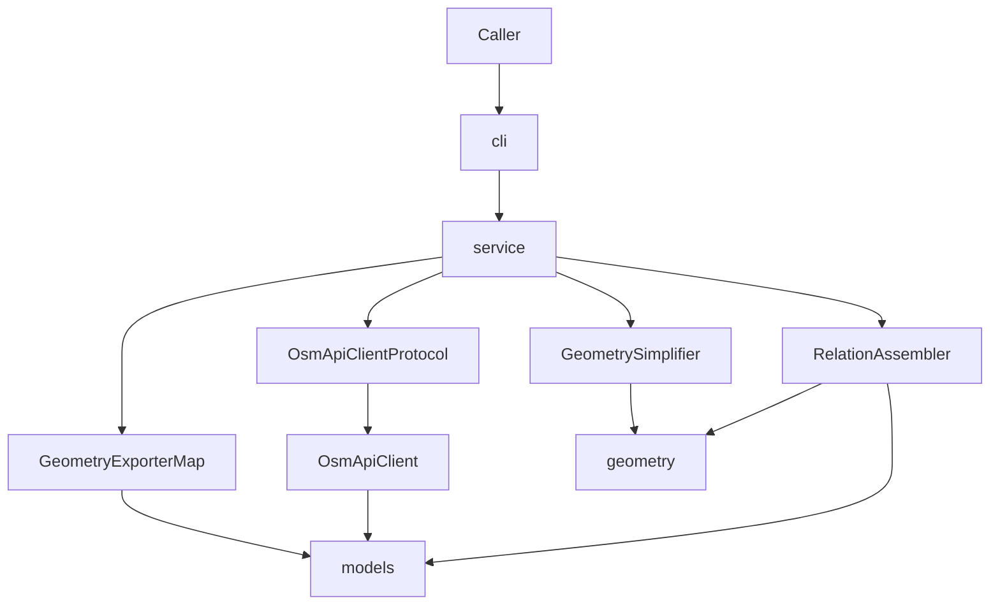
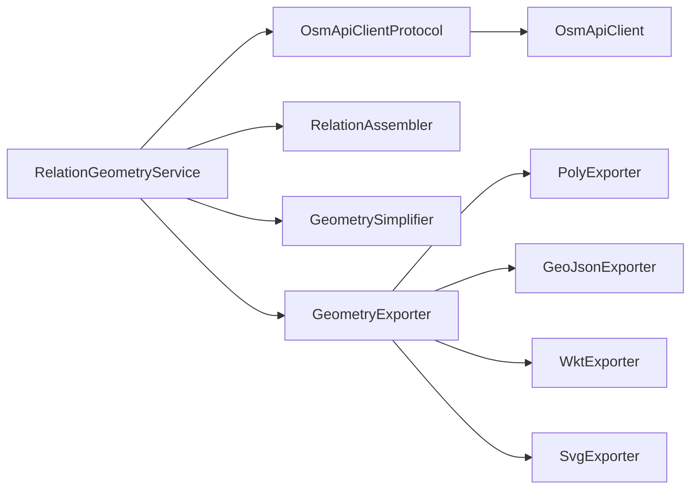

# boundarykit architecture

This document gives the high-level system architecture of the boundarykit
package.

## Purpose and scope

boundarykit builds **multipolygon geometry** for an OpenStreetMap **relation**.
A relation may include ways and nested sub-relations.
The package can simplify rings and export poly, GeoJSON, WKT, or SVG.

This file covers:

- The package shape and module map
- The fetch → assemble → simplify → export data flow
- Client, assembly, simplify, and exporter internals at a high level
- Public surface and extension points
- Error contracts at a high level

This file does **not** cover:

- Full usage examples — see [README.md](../../README.md)
- Domain edit rules and fixture patterns — see
  [boundarykit-domain](../skills/boundarykit-domain/SKILL.md)
- Agent index — see [AGENTS.md](../../AGENTS.md)

## System context

The caller runs the CLI or imports the library.
The package talks to the OSM API 0.6 over HTTPS.
It returns geometry files on disk.
The runtime uses the Python standard library only.
There are no required third-party runtime dependencies.
Python `>=3.11` is required.



## High-level pipeline

[`RelationGeometryService`](../../src/boundarykit/service.py) runs these steps:

1. Fetch `relation/{id}/full` and parse OSM XML into an
   [`ElementStore`](../../src/boundarykit/models.py).
2. Assemble a [`MultiPolygon`](../../src/boundarykit/models.py) from the
   relation members. See [`assembler.py`](../../src/boundarykit/assembler.py).
3. Optionally simplify rings with meter-space Douglas–Peucker. See
   [`simplify.py`](../../src/boundarykit/simplify.py).
4. Export one or more formats through
   [`GeometryExporter`](../../src/boundarykit/exporters/base.py) implementations.

[`cli.build_service`](../../src/boundarykit/cli.py) is the composition root.
It constructs the client, assembler, simplifier, and exporters, then injects
them into the service.



## Module map

| Module | Role |
| ------ | ---- |
| [`cli`](../../src/boundarykit/cli.py) | Argument parsing and composition root |
| [`service`](../../src/boundarykit/service.py) | Orchestration: build geometry and export |
| [`client`](../../src/boundarykit/client.py) | OSM HTTP fetch, retries, XML parse |
| [`assembler`](../../src/boundarykit/assembler.py) | Relation members → multipolygon |
| [`geometry`](../../src/boundarykit/geometry.py) | Shared predicates such as `point_in_ring` |
| [`simplify`](../../src/boundarykit/simplify.py) | Meter-space Douglas–Peucker and topology guards |
| [`models`](../../src/boundarykit/models.py) | OSM elements and geometry dataclasses |
| [`exporters`](../../src/boundarykit/exporters/) | Format writers behind `GeometryExporter` |



## Fetch and parse

[`OsmApiClientProtocol`](../../src/boundarykit/client.py) exposes
`fetch_relation_full`.
[`OsmApiClient`](../../src/boundarykit/client.py) is the default implementation.

The client:

- GETs `{base_url}/relation/{id}/full` with a package User-Agent
- Throttles requests and retries HTTP 429/503
- Caps response size and relation fetch count
- Accepts injectable `urlopen`, `sleep`, and `monotonic` for tests

`parse_osm_xml` turns the XML payload into an `ElementStore` of nodes, ways,
and relations.
Malformed elements raise `OsmClientError`.

## Assembly

[`RelationAssembler`](../../src/boundarykit/assembler.py) builds geometry from
an `ElementStore`.

Way roles:

- `outer` / `inner` (case-insensitive) contribute rings
- Known non-geometry roles are skipped
- Unknown roles raise `AssemblyError`

Nested relations recurse with cycle detection.
Shared nested children are allowed.
True cycles raise `AssemblyError`.

When a nested relation is missing, an optional `fetch_missing` callback can
download and merge another store.

Open ways are chained into closed rings.
Inner rings must lie in exactly one outer ring
([`geometry.point_in_ring`](../../src/boundarykit/geometry.py)).
Empty geometry after assemble is an `AssemblyError` at the service layer.

## Simplify

[`GeometrySimplifier`](../../src/boundarykit/simplify.py) projects lon/lat to
local meters, then runs Douglas–Peucker.

- `tolerance is None` or `tolerance <= 0` is a no-op
- Tolerance is meters under an equirectangular projection
- Rings that would become open, too small, or self-intersecting keep the
  original ring
- Inners that leave the simplified outer keep the original inner

## Export

[`GeometryExporter`](../../src/boundarykit/exporters/base.py) requires
`format_id`, `file_extension`, and `export`.

Built-in exporters:

| Format id | Module | Notes |
| --------- | ------ | ----- |
| `poly` | [`poly.py`](../../src/boundarykit/exporters/poly.py) | Osmosis `.poly` |
| `geojson` | [`geojson.py`](../../src/boundarykit/exporters/geojson.py) | Geometry or Feature |
| `wkt` | [`wkt.py`](../../src/boundarykit/exporters/wkt.py) | WKT or EWKT |
| `svg` | [`svg.py`](../../src/boundarykit/exporters/svg.py) | Preview SVG |

The service selects exporters from a `format_id` map.
Path policy:

- One format + `--output` writes that path
- Otherwise files go under `--output-dir` or the current directory, using a
  sanitized stem from the relation name or id

## Public surface and extension points

Stable entry points:

- CLI: `boundarykit` / `python -m boundarykit`
- Library orchestration: `RelationGeometryService`
- Composition helper: `cli.build_service`

Injected collaborators:

| Abstraction | Default | Role |
| ----------- | ------- | ---- |
| `OsmApiClientProtocol` | `OsmApiClient` | Fetch relation stores |
| `RelationAssembler` | constructed in CLI | Assemble multipolygons |
| `GeometrySimplifier` | constructed in CLI | Optional simplify |
| `GeometryExporter` map | poly, geojson, wkt, svg | Format writers |

To add a format:

1. Implement `GeometryExporter` in `exporters/`.
2. Register it in `cli.build_service`.
3. Add tests under `tests/`.



## Errors and contracts

| Type | When it occurs |
| ---- | -------------- |
| `OsmClientError` | HTTP, size, budget, network, or XML parse failure |
| `AssemblyError` | Geometry cannot be built or is empty |
| `ValueError` | Unknown format or invalid export path combination |
| `OSError` | Filesystem failure while writing outputs |
| `SystemExit` | CLI argument errors from argparse |

[`cli.main`](../../src/boundarykit/cli.py) maps `AssemblyError`,
`OsmClientError`, `OSError`, and `ValueError` to exit code `1`.
Unexpected exceptions propagate.

Validate formats and path combinations in the service before writing files.

## Verification and agent layout

Local verify commands (CI parity):

```bash
uv sync --locked --group dev
uv run black --check src tests
uv run isort --check-only src tests
uv run pylint --rcfile=.pylintrc src/boundarykit tests
uv run python -m unittest discover -s tests -v
```

Unit tests live under `tests/` with XML fixtures in `tests/fixtures/`.

Agent support lives under `.agents/`:

- `rules/` — project policy
- `skills/` — style, SOLID, and domain skills
- `commands/` — local verify command
- `hooks/` — Black + isort after Python file edit
- `docs/` — this architecture file

See [AGENTS.md](../../AGENTS.md) for the full index.
